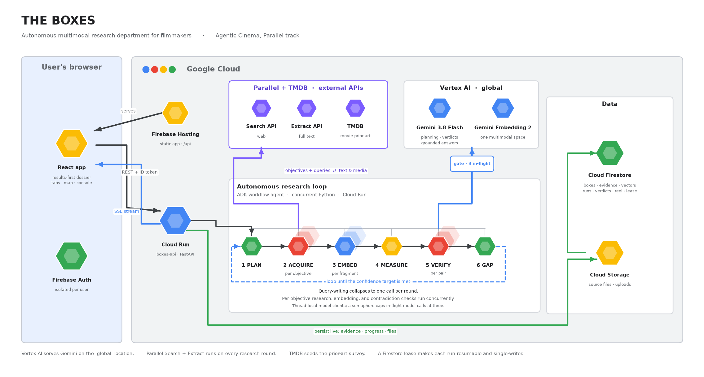

# THE BOXES

An autonomous research department for filmmakers.

Give it a film premise and whatever creative material you already have. It builds
a research plan, searches the live web through Parallel, extracts and embeds
multimodal evidence, measures what it still does not understand, opens its own
follow-up boxes, and stops when it is confident. It also surveys existing films
for a similar premise and states where this one is still unclaimed. The result
is a living, source-backed research archive you can explore with text, images,
documents, audio, or video, or read as a self-contained PDF dossier.

Built for the Agentic Cinema hackathon, Parallel track.

Deployed on Firebase Hosting (frontend) and Cloud Run (backend) under a Google
Cloud project. Configure your own with `.env` / `web/.env` / `.firebaserc`
(see the `*.example` files).



## The idea

Kubrick kept about a thousand boxes of research per film. Clippings, photos,
books, interviews, maps. That pile was his edge, and building it took a team
months of library time. THE BOXES gives every filmmaker the same pile, built
overnight, searchable from a phone.

You type a premise, drop in a few references, and walk away. You come back to a
research library you can question in plain language, with every claim cited, plus
a reference reel cut from the strongest material.

## How the loop works

The agent runs on Cloud Run behind Google's Agent Development Kit. The loop's
control flow is plain, concurrent Python. Objectives research in parallel,
contradiction checks and embeddings verify concurrently, and ADK exposes the
whole thing as a conversational tool surface (`plan_research`, `run_research`,
`query_index`, ...). Every step streams to the browser as it happens.

1. **PLAN.** Gemini 3.8 Flash writes a research ontology from the premise: a list
   of objectives, one per box, each tagged with the production departments it
   would brief. Coverage is measured against this plan.
2. **ACQUIRE.** One call writes the round's search queries for every objective
   at once. Objectives then research concurrently: Parallel **Search** finds
   sources for each one, Parallel **Extract** pulls objective-specific full
   text, and the pages it surfaces are mined for pictures, PDFs, audio, and
   video. Audio and video are trimmed to a short clip with ffmpeg.
3. **EMBED.** Every fragment, text or image or PDF or audio or video, becomes a
   vector with Gemini Embedding 2, embedded concurrently. One 3,072-dimension
   multimodal space, a 768 cut for the hot index. A reference photo and an
   archival photo sit next to each other; a needle-drop sits next to a
   paragraph.
4. **MEASURE.** Per objective: how much evidence supports it and how diverse the
   sources are. Rolled up with source diversity, provenance quality, and a
   genuine-contradiction penalty into one **research confidence** number.
5. **VERIFY.** Embedding similarity finds pairs of evidence about the same thing.
   Gemini then reads both and classifies the relationship as supports,
   contradicts, contextualises, or unrelated, with an explanation and both
   citations, all candidate pairs verified concurrently. Similarity alone
   never decides.
6. **GAP.** The thinnest objectives get fresh queries. If the evidence keeps
   circling a concept with no box, Gemini proposes one and the agent opens it.

The loop ends on its own when confidence reaches the depth's target, or every
objective is well covered, or the round budget runs out.

## Prior art

On request, THE BOXES surveys existing films for a similar premise: TMDB
supplies the candidate pool (IMDb has no official API), one Parallel Search
pass broadens past TMDB's own tagging, and Gemini Embedding 2 ranks every
candidate against the premise by meaning, so a heist "without entering the
vault" finds its real neighbours whatever genre tag it carries. Gemini then
reads the closest films and states which angles none of them take, always
naming which titles that claim was checked against. Originality is claimed
only relative to the surveyed set.

## The multimodal space

Parallel Search returns text. To make Gemini Embedding 2 earn its place, THE
BOXES harvests the other modalities from the pages Parallel surfaces:

| Modality | Where it comes from | Embedded as |
|---|---|---|
| text | Parallel Extract full content | text |
| image | og:image and substantive inline images | picture + caption |
| pdf | links ending `.pdf`, fetched whole (`%PDF-`, up to 12 MB) | document + caption |
| audio | `<audio>`, og:audio, direct `.mp3` / `.wav` / `.m4a` links | ffmpeg-trimmed clip + caption |
| video | `<video>`, og:video, direct `.mp4` / `.webm` links | ffmpeg-trimmed clip + caption |

Every asset keeps its full source URL and a rights note (`likely reusable` for
wikimedia, loc.gov, nasa.gov, si.edu, archive.org; `check rights` otherwise).
Trimmed clips link back to the full recording at its source.

## The app

| Surface | What it does |
|---|---|
| **Research map** | Dark canvas, a dot per fragment coloured by box; images are thumbnails, other media are glyphs. Click a box to focus it; click any dot to open it in a detail modal, full text and media included; filter the whole map by production department. Emergent boxes pulse. |
| **Cinematic console** | A 2001-style mission-control panel while a run is active: phase headline (`ACQUIRING`, `CROSS-EXAMINING SOURCES`), block-character progress bars for objective / coverage / confidence, a fragment counter, a teletype log, a scanline. |
| **Expandable ledger** | One row per research pass, expandable to that pass's search queries and a compact, deduplicated list of the evidence it added. Click any item for the same detail modal as the map. |
| **Contradictions** | Verified verdicts with the explanation and both citations. |
| **Departments** | Every box tagged with the crews it briefs (script, casting, costume, art direction, sound, cinematography, locations); filter the map or the PDF report down to one department's evidence. |
| **Prior art** | Survey on demand; a poster grid of the closest existing films and the angles none of them take, each grounded in named titles. |
| **Add your own reference** | Upload a text, PDF, or image to any box. It is embedded into the same space as the agent's findings. |
| **Ask the boxes** | A cited answer from the index; image and media answers render inline. |
| **Reference reel** | Timed beats, each with clickable sources and inline audio or video players. |
| **PDF dossier** | One click builds a self-contained report: a synthesized picture of the world up top, then every box as a plain-language summary plus its deduplicated sources, contradictions, the reel, department packets, and the prior-art survey. Readable with no other context. |
| **Theme** | Light, dark, or system, everywhere including the landing page. |

Evidence and progress are persisted to Firestore as they stream, so the map and
box counts fill in live during a run.

## Research depth

The same agent, tuned for how hard it digs.

| Depth | Objectives | Follow-up rounds | Confidence target | Images / PDFs / A-V per round |
|---|---:|---:|---:|---:|
| scout | 5 | up to 2 | 80% | 4 / 2 / 2 |
| production | 10 | up to 3 | 82% | 10 / 5 / 4 |
| kubrick | 16 | up to 6 | 90% | 20 / 10 / 8 |

## Stack

| Part | Choice |
|---|---|
| Agent | Google Agent Development Kit (ADK) tool surface on Cloud Run. The loop's own control flow is concurrent Python: objectives, contradiction checks, and embeddings all run in parallel |
| Reasoning | Gemini 3.8 Flash (`gemini-3.8-flash`, GA 2 September 2026), Vertex AI `global` location |
| Acquisition | Parallel **Search** + **Extract**, imported and called on the hot path every round |
| Prior art | TMDB for the candidate pool, Parallel Search to broaden past its tagging |
| Embeddings | Gemini Embedding 2 (`gemini-embedding-2`), natively multimodal, 3,072-dim stored, 768-dim hot index |
| Frontend | Vite + React, Firebase Hosting |
| Auth | Firebase Authentication (Google), one isolated project subtree per user |
| Persistence | Cloud Firestore (`users/{uid}/…`), Cloud Storage for source files and uploads |
| Backend | FastAPI on Cloud Run, verifies Firebase ID tokens, streams the loop over SSE |
| Report | reportlab, one Gemini call synthesizes the plain-language narrative, Pillow for embedded moodboard images |
| Media | ffmpeg in the container, trims harvested audio and video before embedding |
| Vector search | brute-force over the stored 768-d vectors; swap for Vertex AI Vector Search at scale |

## Repo layout

```
src/boxes/
  config.py           environment + Secret Manager
  llm.py              shared Gemini client, JSON reasoning (thinking disabled)
  embeddings.py       Gemini Embedding 2 helpers, task prefixes, multimodal parts
  evidence.py         the evidence unit: provenance, modality, media URL, round, vector
  ontology.py         research plan + emergent-box detection, batched per round
  parallel_search.py  Parallel Search + Extract, plus image/pdf/audio/video harvest
  media.py            ffmpeg trims audio/video to a short clip
  coverage.py         per-objective coverage + research confidence + stopping rule
  contradiction.py    embedding candidate pairs, Gemini verdicts, verified concurrently
  prior_art.py        TMDB + Parallel candidate pool, embedding-ranked, Gemini positioning
  synthesis.py        plain-language narrative for the PDF report, box by box
  depth.py            scout / production / kubrick presets
  ledger.py           the per-round research ledger
  reel.py             the reference reel
  research_loop.py    the autonomous loop; objectives research concurrently each round
  agent.py            the ADK agent and its tools
  vectorstore.py      brute-force nearest neighbor
service/              FastAPI backend for Cloud Run (auth, SSE, Firestore/Storage, report.py the PDF dossier)
web/                  Vite + React app (map, console, ledger, reel, evidence modal, theme)
docs/architecture.py  the diagram source
scripts/              access probes and the full research run
```

## Run it locally

Backend and models:

```bash
python -m venv .venv && . .venv/bin/activate      # Windows: .venv\Scripts\activate
pip install -r requirements.txt -r service/requirements.txt
cp .env.example .env                               # project id + Parallel key
gcloud auth application-default login
gcloud auth application-default set-quota-project YOUR_GCP_PROJECT
```

Gemini 3.x and Gemini Embedding 2 are served on the Vertex `global` location, so
`GOOGLE_CLOUD_LOCATION=global`. The Parallel key goes in `.env` as
`PARALLEL_API_KEY`, or in Secret Manager under the same name. `TMDB_API_KEY`
is optional and takes TMDB's v3 API key; the longer v4 read access token will
not authenticate. Without it, prior art still runs on Parallel Search alone,
with a thinner pool.

```bash
python scripts/probe_access.py           # confirm model access
python scripts/research_run.py scout "A political drama during the founding of NASA in 1958"
adk web src                              # local ADK dev UI at localhost:8000

# full stack
BOXES_DEV_UID=dev uvicorn main:app --app-dir service --port 8080   # backend
cd web && npm install && npm run dev                               # frontend on :5173
```

## Deploy

```bash
# backend
gcloud run deploy boxes-api --source . --project YOUR_GCP_PROJECT --region us-central1 \
  --service-account boxes-agent@YOUR_GCP_PROJECT.iam.gserviceaccount.com \
  --set-env-vars GOOGLE_CLOUD_PROJECT=YOUR_GCP_PROJECT,GOOGLE_CLOUD_LOCATION=global,GOOGLE_GENAI_USE_VERTEXAI=TRUE,FIREBASE_STORAGE_BUCKET=YOUR_GCP_PROJECT.firebasestorage.app \
  --set-secrets PARALLEL_API_KEY=PARALLEL_API_KEY:latest,TMDB_API_KEY=TMDB_API_KEY:latest \
  --allow-unauthenticated --cpu 2 --memory 2Gi --timeout 3600 --max-instances 3

# rules + frontend
firebase deploy --only firestore:rules,storage --project YOUR_GCP_PROJECT
cd web && npm run build && cd .. && firebase deploy --only hosting --project YOUR_GCP_PROJECT
```

## License

Apache-2.0. See [LICENSE](LICENSE).
